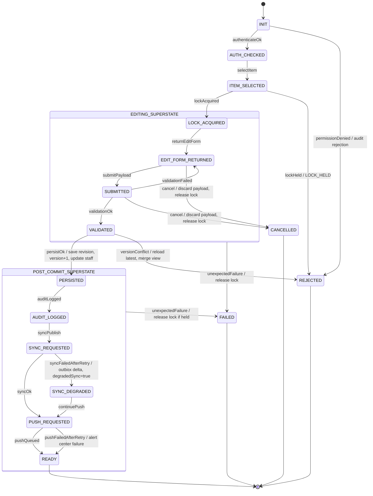

# WS3 RED-SHA K-MedTour Dynamic Modeling

## 1. 문서 정보

| 항목 | 내용 |
|---|---|
| 시스템명 | K-의료관광솔루션 / K-MedTour |
| 팀명 | RED-SHA |
| 대상 Use Case | UC-ADM-07 Edit Itinerary |
| 기준 브랜치 | `feature/L3-L4` |
| 현재 작업 브랜치 | `experiment/L5-chatgpt-run1` |
| 기준 Commit | `78b5c8e025b0717d7dfd223aa74cde9106bf0382` |
| 적용 범위 | L1~L4 산출물을 입력으로 UC-ADM-07의 L5 Dynamic Modeling 명세를 정의한다. Java 구현은 수행하지 않는다. |
| 작성 원칙 | 실제 소스의 클래스명, 메서드명, DTO 필드, Java 타입을 우선 사용한다. 실제 소스에 없는 클래스/메서드는 "신규 생성 후보" 또는 "확인 필요"로 표시한다. |

> 참고: 사용자 요청의 `UseCaseDescription_UC-ADM-07_reviewed.md`는 저장소에 존재하지 않는다. 실제 확인된 파일명은 `docs/UseCaseDescription_UC-ADM-07_reviewd.md`이다. 파일명 정정 여부는 확인 필요.

## 2. L1~L4 입력 산출물

| Level | 파일 | 역할 |
|---|---|---|
| L1 | `Output_L1/EditItinerary.java` | UC-ADM-07의 최상위 Use Case 골격. `SynchronizeRealtimeState`, `SendPushNotification`, `AuditLogAction` include 관계를 표현한다. |
| L1 | `Output_L1/SynchronizeRealtimeState.java` | ABS-04 실시간 상태 동기화 추상 UC 골격. |
| L1 | `Output_L1/SendPushNotification.java` | ABS-05 푸시 알림 추상 UC 골격. |
| L1 | `Output_L1/AuditLogAction.java` | ABS-06 감사 로그 추상 UC 골격. |
| L1 | `Output_L1/AgencyAdmin.java` | UC-ADM-07 관련 Actor 골격. |
| L1 | `Output_L1/RealtimeSyncBus.java` | 외부 실시간 동기화 시스템 골격. |
| L1 | `Output_L1/PushNotificationGateway.java` | 외부 푸시 알림 게이트웨이 골격. |
| L2 | `Output_L2/EditItinerary.java` | UC-ADM-07 정상 흐름과 A1~A7 Alternative를 단계 번호로 구현한 중심 Control 후보. |
| L2 | `Output_L2/ItineraryRepository.java` | 편집 락, editable form 조회, 새 revision 저장, 최신 revision 재조회, 락 해제를 정의한다. |
| L2 | `Output_L2/ItineraryItem.java` | L2 일정 항목 데이터 객체. `version`, `startTime`, `endTime`, `location`, `assignedStaffIds`를 가진다. |
| L2 | `Output_L2/EditPayload.java` | L2 일정 수정 payload. |
| L2 | `Output_L2/EditItineraryResponse.java` | `success`, `updatedItineraryView`, `degradedSync`, `errorCode`, `errorDetail` 응답 구조. |
| L2 | `Output_L2/ErrorCode.java` | `LOCK_HELD`, `PERMISSION_DENIED`, `VALIDATION_FAILED`, `OPTIMISTIC_LOCK_CONFLICT` 오류 코드. |
| L2 | `Output_L2/SynchronizeRealtimeState.java` | A3 재시도 정책과 실시간 발행 결과 boolean 반환을 정의한다. |
| L2 | `Output_L2/SendPushNotification.java` | A4 재시도 정책과 푸시 큐잉 결과 boolean 반환을 정의한다. |
| L2 | `Output_L2/RetryPolicy.java` | 지수 백오프 상수: 초기 1초, 배수 2, 최대 3회. |
| L2 | `Output_L2/*Exception.java` | A1/A2/A5/A6/A7 관련 예외 타입. |
| L3 | `Output_L3+L4/docs/SA.md` | C15 `ScheduleItem`, C14 `PatientJourney`, NFR, 상태 전이, 입력 검증 규칙. |
| L3/L4 | `Output_L3+L4/docs/README.md` | BCE 계층 구조, `ifo -> control -> entity`, DTO 분리, Adapter 구성 원칙. |
| L3/L4 | `Output_L3+L4/docs/L3L4_ANALYSIS.md` | L2 대비 L3+L4 구조 변화, 동시성 미해결 지점, AI 임의 생성 클래스 목록. |
| L4 | `Output_L3+L4/src/main/java/com/kmedical/ifo/admin/ScheduleEditorView.java` | 관리자 일정 편집 View. `viewJourney`, `viewScheduleItems`, `addScheduleItem`, `updateScheduleItem` 제공. |
| L4 | `Output_L3+L4/src/main/java/com/kmedical/http/JourneyHandler.java` | `/api/journeys/**` HTTP Handler. 현재 일정 추가/조회만 구현, 일정 수정 endpoint는 없음. |
| L4 | `Output_L3+L4/src/main/java/com/kmedical/control/JourneyController.java` | 여정/일정 Control. `updateScheduleItem`, `addScheduleItem`, `getScheduleItems` 구현. |
| L4 | `Output_L3+L4/src/main/java/com/kmedical/control/AlertController.java` | 알림 생성/발송 Control. `notifyScheduleChange`, `sendAlert` 구현. |
| L4 | `Output_L3+L4/src/main/java/com/kmedical/control/StaffAssignmentController.java` | 일정 항목별 실무자 배정 Control. `assignStaff`, `getAssignmentsByScheduleItem` 구현. |
| L4 | `Output_L3+L4/src/main/java/com/kmedical/domain/entity/ScheduleItem.java` | C15 일정 항목 Entity. |
| L4 | `Output_L3+L4/src/main/java/com/kmedical/domain/entity/PatientJourney.java` | C14 환자 여정 Entity. |
| L4 | `Output_L3+L4/src/main/java/com/kmedical/domain/entity/StaffAssignment.java` | C16 실무자 배정 Entity. |
| L4 | `Output_L3+L4/src/main/java/com/kmedical/dto/journey/ScheduleItemDTO.java` | Interface 계층 노출용 ScheduleItem DTO. |
| L4 | `Output_L3+L4/src/main/java/com/kmedical/dto/journey/ScheduleItemUpdateRequestDTO.java` | Interface -> `JourneyController` 일정 수정 요청 DTO. |
| L4 | `Output_L3+L4/src/main/java/com/kmedical/adapter/PushAdapter.java` | 푸시 알림 Adapter. `sendPush`, `sendBulkPush` 제공. |

## 3. 대상 객체 및 책임

기존 패키지 흐름은 `ifo -> http -> control -> dto/entity -> adapter` 방향을 유지한다. 현재 L4 코드에는 `ifo -> control` 직접 호출 경로와 `http -> control` 서버 경로가 함께 존재한다.

| 분류 | 실제 객체 | 책임 |
|---|---|---|
| User Interface 또는 View | `com.kmedical.ifo.admin.ScheduleEditorView` | 관리자 일정 조회/추가/수정 진입점. 현재 `updateScheduleItem(ScheduleItemUpdateRequestDTO)`가 `JourneyController.updateScheduleItem`을 직접 호출한다. |
| User Interface 또는 View | `com.kmedical.ifo.admin.StaffAssignmentView` | 일정 항목별 실무자 배정/조회 진입점. UC-ADM-07의 assigned staff 변경과 연결 가능성이 있으나 현재 Edit Itinerary에 직접 연결되어 있지 않다. |
| HTTP Interface 또는 Handler | `com.kmedical.http.JourneyHandler` | `/api/journeys/**` 요청 처리. 현재 `POST /api/journeys/{id}/schedule`, `GET /api/journeys/{id}/schedule`만 있고 일정 항목 수정 endpoint는 확인되지 않는다. |
| HTTP Interface 또는 Handler | `com.kmedical.http.StaffAssignmentHandler` | `/api/assignments` 요청 처리. 담당자 변경을 별도 API로 처리할 가능성이 있으나 UC-ADM-07 통합 순서는 확인 필요. |
| State-dependent Control | `com.kmedical.control.SystemStateRegistry` | 시스템 RUNNING/CLOSED_DOWN 상태를 관리한다. UC-ADM-07 편집 세션 상태는 현재 별도 객체로 존재하지 않는다. |
| State-dependent Control | 신규 생성 후보: `EditItinerarySession` 또는 동등 상태 객체 | L2의 lock acquired, editing, validating, persisted, sync degraded, cancelled 등의 UC 실행 상태를 보유할 후보. 실제 소스에 없음. |
| Business Logic 또는 Controller | `com.kmedical.control.JourneyController` | 여정 생성/조회, 일정 항목 추가/수정/조회, `ScheduleItemStatus` 상태 전이 검증. |
| Business Logic 또는 Controller | `com.kmedical.control.AlertController` | `AlertCreateRequestDTO` 기반 알림 생성과 `PushAdapter`/`MessengerAdapter` 호출. |
| Business Logic 또는 Controller | `com.kmedical.control.StaffAssignmentController` | `StaffAssignment` 저장, 역할 중복 검사, 실무자 푸시 알림 발송. |
| Entity | `com.kmedical.domain.entity.ScheduleItem` | 일정 항목. `scheduleItemId`, `patientJourneyId`, `itemType`, `title`, `scheduledStartAt`, `scheduledEndAt`, `locationAddressEn`, `locationCoordLat`, `locationCoordLng`, `status`, `isCritical`, `memo`, `sortOrder`. |
| Entity | `com.kmedical.domain.entity.PatientJourney` | 환자 여정. `patientJourneyId`, `patientId`, `agencyId`, `quotationId`, `itineraryTemplateId`, `status`, `arrivalDate`, `departureDate`, `createdAt`, `updatedAt`. |
| Entity | `com.kmedical.domain.entity.StaffAssignment` | 일정 항목별 실무자 배정. `assignmentId`, `scheduleItemId`, `staffId`, `staffRole`, `assignedBy`, `assignedAt`, `notificationSentAt`. |
| Entity | `com.kmedical.domain.entity.Alert` | 알림 상태와 발송 결과. |
| DTO | `com.kmedical.dto.journey.ScheduleItemDTO` | `ScheduleItem` 복사 DTO. 일정 추가/조회에 사용된다. |
| DTO | `com.kmedical.dto.journey.ScheduleItemUpdateRequestDTO` | 일정 수정 요청 DTO. `sortOrder`와 assigned staff 정보가 없다. |
| DTO | `com.kmedical.dto.journey.PatientJourneyDTO` | `PatientJourney` 복사 DTO. |
| DTO | `com.kmedical.dto.staff.StaffAssignmentCreateRequestDTO` | 실무자 배정 생성 요청 DTO. |
| DTO | `com.kmedical.dto.staff.StaffAssignmentDTO` | `StaffAssignment` 복사 DTO. |
| DTO | `com.kmedical.dto.alert.AlertCreateRequestDTO` | 알림 생성 요청 DTO. |
| DTO | `com.kmedical.dto.alert.AlertDTO` | 알림 결과 DTO. |
| Adapter | `com.kmedical.adapter.PushAdapter` | 푸시 알림 외부 시스템 호출. `sendPush`는 boolean, `sendBulkPush`는 void 반환. |
| Adapter | `com.kmedical.adapter.MessengerAdapter` | WhatsApp/Email 외부 시스템 호출. |
| 외부 시스템 | L1 `RealtimeSyncBus`, L2 `RealtimeSyncBus` | UC-ADM-07 Step 11 실시간 스냅샷 발행 대상. L4에는 대응 Adapter가 확인되지 않는다. |
| 외부 시스템 | L1 `PushNotificationGateway`, L2 `PushNotificationGateway`, L4 `PushAdapter` | UC-ADM-07 Step 12 푸시 알림 대상. L4에서는 `PushAdapter`로 추상화되어 있다. |

## 4. 메시지 상호작용 명세

번호 규칙:

- 정수 번호는 L2 Use Case Description의 외부 단계 번호를 계승한다.
- 소수 번호는 해당 단계 내부의 객체 간 호출 순서를 의미한다.
- Alternative는 `A1`, `A2` 등으로 별도 표기한다.
- `concurrent`는 동일 전이에서 독립 출력이 병렬 가능함을 의미한다.
- `ACK`는 처리 완료 사실만 통지하는 응답이 실제로 필요한 경우에만 표시한다.

현재 L4에는 UC-ADM-07 전용 endpoint, 전용 `EditItinerary` Control, 편집 세션 상태 객체, `version`, edit lock, realtime sync adapter가 없다. 해당 호출은 L2 근거의 L5 명세 후보로 작성하고 "확인 필요"를 표시한다.

| 번호 | 송신 객체 | 수신 객체 | 메시지 또는 메서드 | 입력 DTO | 반환값 | 동기/concurrent/ACK | 관련 L2 단계 |
|---:|---|---|---|---|---|---|---|
| 1.1 | `JourneyHandler` 또는 `ScheduleEditorView` | 인증/RBAC Control | Authenticate User 결과 확인 | 확인 필요 | 인증/권한 결과 | 동기 | Step 1 |
| 1.A6.1 | 인증/RBAC Control | 호출자 | 권한 거부 반환 | 없음 | `PERMISSION_DENIED` 후보 | 동기 | A6 |
| 1.A6.2 | 인증/RBAC Control | 감사 로그 Control | Audit Log Action include | operatorId, denialReason 후보 | 처리 결과 | 동기 또는 ACK 확인 필요 | A6.2 |
| 2.1 | Agency Operator | `ScheduleEditorView` | `viewScheduleItems(String journeyId)` | 없음 | `List<ScheduleItemDTO>` | 동기 | Step 2 |
| 2.2 | `ScheduleEditorView` | `JourneyController` | `getScheduleItems(String journeyId)` | 없음 | `List<ScheduleItemDTO>` | 동기 | Step 2 |
| 2.3 | `JourneyHandler` | `JourneyController` | `getScheduleItems(String journeyId)` | 없음 | `List<ScheduleItemDTO>` | 동기 | Step 2 |
| 3.1 | UC-ADM-07 Control 후보 | 편집 락 저장소 후보 | 일정 항목 편집 락 획득 | `scheduleItemId` | 성공 또는 lock holder | 동기 | Step 3 |
| 3.A7.1 | 편집 락 저장소 후보 | UC-ADM-07 Control 후보 | lock held 반환 | 없음 | `LOCK_HELD`, lockHolderId 후보 | 동기 | A7 |
| 4.1 | `ScheduleEditorView` 또는 `JourneyHandler` | `JourneyController` | `getJourney(String journeyId)` | 없음 | `PatientJourneyDTO` | 동기 | Step 4 |
| 4.2 | `ScheduleEditorView` 또는 `JourneyHandler` | `JourneyController` | `getScheduleItems(String journeyId)` | 없음 | `List<ScheduleItemDTO>` | 동기 | Step 4 |
| 5.1 | Agency Operator | `ScheduleEditorView` | `updateScheduleItem(ScheduleItemUpdateRequestDTO request)` | `ScheduleItemUpdateRequestDTO` | `ScheduleItemDTO` | 동기 | Step 5 |
| 5.2 | HTTP Client | `JourneyHandler` | 수정 endpoint 확인 필요 | 기존 DTO 재사용 시 `ScheduleItemUpdateRequestDTO`; 신규 후보는 `EditItineraryRequestDTO` | 수정 응답 DTO 후보 | 동기 | Step 5 |
| 6.1 | `ScheduleEditorView` | `JourneyController` | `updateScheduleItem(ScheduleItemUpdateRequestDTO request)` | `ScheduleItemUpdateRequestDTO` | `ScheduleItemDTO` 또는 예외 | 동기 | Step 6 |
| 6.2 | `JourneyController` | `ValidationUtil` | `requireNotNull`, `requireNotBlank`, `requireLengthBetween`, `requireLatitude`, `requireLongitude`, `requireEndAfterStart` | 개별 필드 | 없음 또는 `IllegalArgumentException` | 동기 | Step 6 |
| 6.3 | `JourneyController` | 형제 일정 조회 로직 후보 | 시간대 중복 검사 | `patientJourneyId`, start/end 후보 | boolean | 동기 | Step 6 |
| 6.A1.1 | `JourneyController` | 호출자 | 필드 수준 오류 반환 | 확인 필요 | `VALIDATION_FAILED` 후보 | 동기 | A1 |
| 7.1 | `JourneyController` | `ScheduleItem` | 기존 항목 조회: `findScheduleItem(String id)` | `scheduleItemId` | `ScheduleItem` | 동기 | Step 7 |
| 7.2 | UC-ADM-07 Control 후보 | `ScheduleItem` 또는 저장소 후보 | version 정수 비교 | expectedVersion 후보 | 성공 또는 conflict | 동기 | Step 7 |
| 7.A2.1 | 저장소 후보 | UC-ADM-07 Control 후보 | optimistic lock conflict | 없음 | `OPTIMISTIC_LOCK_CONFLICT` 후보 | 동기 | A2 |
| 7.A2.2 | UC-ADM-07 Control 후보 | `JourneyController` | 최신 revision 재조회 후보 | `scheduleItemId` | `ScheduleItemDTO` 후보 | 동기 | A2 |
| 7.A2.3 | UC-ADM-07 Control 후보 | UI/HTTP 호출자 | merge view 표시 데이터 반환 | 최신값 + 제출값 후보 | merge view DTO 후보 | 동기 | A2 |
| 8.1 | UC-ADM-07 Control 후보 | `ScheduleItem` | version 증가 | 없음 | 없음 | 동기 | Step 8 |
| 9.1 | UC-ADM-07 Control 후보 | `StaffAssignmentController` | `getAssignmentsByScheduleItem(String scheduleItemId)` | 없음 | `List<StaffAssignmentDTO>` | 동기 | Step 9 |
| 9.2 | UC-ADM-07 Control 후보 | `StaffAssignmentController` | 담당자 변경 후보 | `StaffAssignmentCreateRequestDTO` 또는 신규 집합 DTO 후보 | `StaffAssignmentDTO` 목록 후보 | 동기 | Step 9 |
| 10.1 | UC-ADM-07 Control 후보 | 감사 로그 Control 후보 또는 `AuditLogger` | 변경 전후 diff 기록 | JSON Patch diff 후보 | 처리 결과 | 동기 또는 ACK 확인 필요 | Step 10 |
| 11.1 | UC-ADM-07 Control 후보 | 실시간 동기화 Adapter 후보 | 갱신 스냅샷 발행 | `ScheduleItemDTO` 또는 Aggregate DTO 후보 | 성공 여부 | concurrent 가능 | Step 11 |
| 11.2 | 실시간 동기화 Adapter 후보 | UC-ADM-07 Control 후보 | 발행 완료 ACK 후보 | 없음 | ACK | ACK, concurrent | Step 11 |
| 11.A3.1 | 실시간 동기화 Adapter 후보 | UC-ADM-07 Control 후보 | 발행 실패 | 없음 | 실패 | 동기 | A3 |
| 11.A3.2 | UC-ADM-07 Control 후보 | 지연 발송 큐 후보 | delta 기록 | delta DTO 후보 | 처리 결과 | 동기 | A3.1 |
| 11.A3.3 | UC-ADM-07 Control 후보 | 호출자 | degraded success 설정 | 없음 | `degradedSync=true` 후보 | 동기 | A3.2~A3.3 |
| 12.1 | UC-ADM-07 Control 후보 | `StaffAssignmentController` | `getAssignmentsByScheduleItem(String scheduleItemId)` | 없음 | `List<StaffAssignmentDTO>` | 동기 | Step 12 |
| 12.2 | UC-ADM-07 Control 후보 | 환자 매직 링크 resolver 후보 | patient magic link endpoint 조회 | `patientJourneyId` 후보 | `String` endpoint 후보 | 동기 | Step 12 |
| 12.3 | UC-ADM-07 Control 후보 | `AlertController` 또는 `PushAdapter` | `sendAlert(AlertCreateRequestDTO)` 또는 `sendBulkPush(List<String>, String, String)` | `AlertCreateRequestDTO` 또는 staffId list | `AlertDTO` 또는 void | concurrent 가능 | Step 12 |
| 12.A4.1 | `PushAdapter` | 호출자 | 5xx/실패 반환 | 없음 | boolean false 또는 예외 후보 | 동기 | A4 |
| 12.A4.2 | UC-ADM-07 Control 후보 | 알림 센터 후보 | 실패 기록 | staffIds, endpoint 후보 | 처리 결과 | 동기 또는 ACK 확인 필요 | A4.1 |
| 13.1 | UC-ADM-07 Control 후보 | 편집 락 저장소 후보 | 편집 락 해제 | `scheduleItemId` | 없음 | 동기, ACK 불필요 | Step 13 |
| 14.1 | UC-ADM-07 Control 후보 | 호출자 | 갱신 일정 뷰 반환 | 없음 | `ScheduleItemDTO` 또는 Aggregate response 후보 | 동기 | Step 14 |
| 15.1 | 호출자 | UI/HTTP | 대시보드 준비 상태 복귀 | 없음 | 다음 입력 가능 | ACK 후보 | Step 15 |
| A5.1 | Agency Operator | `ScheduleEditorView` 또는 `JourneyHandler` | 편집 취소 | cancel signal 후보 | 없음 | 동기 | A5 |
| A5.2 | UC-ADM-07 Control 후보 | 편집 락 저장소 후보 | 편집 락 해제 | `scheduleItemId` | 없음 | 동기 | A5.2 |
| A5.3 | UC-ADM-07 Control 후보 | 호출자 | 정상 취소 응답 | 없음 | cancelled response 후보 | 동기 | A5.3 |

## 5. Aggregate DTO 명세

### 5.1 기존 DTO 재사용 가능성

| DTO | 실제 필드 | 재사용 가능성 | 판단 |
|---|---|---|---|
| `ScheduleItemDTO` | `scheduleItemId`, `patientJourneyId`, `itemType`, `title`, `scheduledStartAt`, `scheduledEndAt`, `locationAddressEn`, `locationCoordLat`, `locationCoordLng`, `status`, `isCritical`, `memo`, `sortOrder` | 부분 가능 | 일정 항목 자체의 조회/추가/반환에는 적합하다. 하지만 UC-ADM-07의 수정 요청에는 `expectedVersion`, operator 식별자, assigned staff 변경 목록, cancel/degraded/error 정보가 없다. |
| `ScheduleItemUpdateRequestDTO` | `scheduleItemId`, `itemType`, `title`, `scheduledStartAt`, `scheduledEndAt`, `locationAddressEn`, `locationCoordLat`, `locationCoordLng`, `status`, `isCritical`, `memo` | 부분 가능 | 실제 `JourneyController.updateScheduleItem` 입력으로 사용된다. 하지만 `sortOrder`, `patientJourneyId`, `assignedStaffIds`, `expectedVersion`, `operatorId`, edit lock token이 없어 UC-ADM-07 전체 L2 흐름을 담기 부족하다. |

결론: 기존 DTO는 하위 구성 요소로 재사용 가능하다. UC-ADM-07 전체 요청/응답을 추적하려면 Aggregate DTO 신규 생성 후보가 필요하다. 단, 이번 L5 문서에서는 신규 Java 클래스를 생성하지 않는다.

### 5.2 기존 DTO: `ScheduleItemUpdateRequestDTO`

| 필드명 | Java 타입 | 출처 Entity 속성 | 필수 여부 | 설명 |
|---|---|---|---|---|
| `scheduleItemId` | `String` | `ScheduleItem.scheduleItemId` | 필수 | 수정 대상 일정 항목 식별자. |
| `itemType` | `ScheduleItemType` | `ScheduleItem.itemType` | 선택 | 일정 항목 유형. 현재 `JourneyController.updateScheduleItem`에서 setter가 호출되지 않음. 확인 필요. |
| `title` | `String` | `ScheduleItem.title` | 선택 | 일정 제목. 1~200자 검증. |
| `scheduledStartAt` | `LocalDateTime` | `ScheduleItem.scheduledStartAt` | 선택 | 예정 시작 시각. L2의 시작 시각. |
| `scheduledEndAt` | `LocalDateTime` | `ScheduleItem.scheduledEndAt` | 선택 | 예정 종료 시각. `scheduledEndAt.isAfter(scheduledStartAt)` 검증. |
| `locationAddressEn` | `String` | `ScheduleItem.locationAddressEn` | 선택 | 장소 주소. |
| `locationCoordLat` | `BigDecimal` | `ScheduleItem.locationCoordLat` | 선택 | 위도. -90~90 검증. |
| `locationCoordLng` | `BigDecimal` | `ScheduleItem.locationCoordLng` | 선택 | 경도. -180~180 검증. |
| `status` | `ScheduleItemStatus` | `ScheduleItem.status` | 선택 | `SCHEDULED -> IN_PROGRESS -> COMPLETED` 순방향 전이만 허용. |
| `isCritical` | `Boolean` | `ScheduleItem.isCritical` | 선택 | 중요 일정 여부. true면 현재 L4는 `AlertController.notifyScheduleChange` 호출. |
| `memo` | `String` | `ScheduleItem.memo` | 선택 | 운영자 메모. max 1000자. |

### 5.3 기존 DTO: `ScheduleItemDTO`

| 필드명 | Java 타입 | 출처 Entity 속성 | 필수 여부 | 설명 |
|---|---|---|---|---|
| `scheduleItemId` | `String` | `ScheduleItem.scheduleItemId` | 반환 시 필수 | 서버 생성 UUID. |
| `patientJourneyId` | `String` | `ScheduleItem.patientJourneyId` | 필수 | 소속 여정 ID. |
| `itemType` | `ScheduleItemType` | `ScheduleItem.itemType` | SA 기준 필수 | 일정 유형. |
| `title` | `String` | `ScheduleItem.title` | SA 기준 필수 | 일정 제목. |
| `scheduledStartAt` | `LocalDateTime` | `ScheduleItem.scheduledStartAt` | SA 기준 필수 | 예정 시작 시각. |
| `scheduledEndAt` | `LocalDateTime` | `ScheduleItem.scheduledEndAt` | SA 기준 필수 | 예정 종료 시각. |
| `locationAddressEn` | `String` | `ScheduleItem.locationAddressEn` | 선택 | 영문 주소. |
| `locationCoordLat` | `BigDecimal` | `ScheduleItem.locationCoordLat` | 선택 | 위도. |
| `locationCoordLng` | `BigDecimal` | `ScheduleItem.locationCoordLng` | 선택 | 경도. |
| `status` | `ScheduleItemStatus` | `ScheduleItem.status` | 필수 | 진행 상태. |
| `isCritical` | `Boolean` | `ScheduleItem.isCritical` | 필수 | 중요 일정 여부. |
| `memo` | `String` | `ScheduleItem.memo` | 선택 | 운영자 메모. |
| `sortOrder` | `Integer` | `ScheduleItem.sortOrder` | SA 기준 필수 | 표시 순서. |

### 5.4 신규 생성 후보: `EditItineraryRequestDTO`

실제 소스에는 없다. L5 이후 구현 후보로만 제안한다.

| 필드명 | Java 타입 | 출처 Entity 속성 | 필수 여부 | 설명 |
|---|---|---|---|---|
| `operatorId` | `String` | 확인 필요 | 필수 | L2 Step 1, Step 10 감사 로그의 운영자 식별자. 현재 L4 DTO에는 없음. |
| `patientJourneyId` | `String` | `ScheduleItem.patientJourneyId` | 필수 | 형제 일정 중복 검사와 응답 Aggregate 구성에 필요. |
| `scheduleItemId` | `String` | `ScheduleItem.scheduleItemId` | 필수 | 수정 대상 일정 항목. |
| `expectedVersion` | `Integer` | L2 `ItineraryItem.version` | 필수 | A2 optimistic lock 비교 기준. L4 `ScheduleItem`에는 version 필드가 없어 Entity 확장 여부 확인 필요. |
| `patch` | `ScheduleItemUpdateRequestDTO` | `ScheduleItem` | 필수 | 기존 수정 요청 DTO 재사용. |
| `assignedStaffIds` | `List<String>` | L2 `EditPayload.assignedStaffIds`, L4 `StaffAssignment.staffId` | 선택 또는 필수 확인 필요 | L2 Step 9, 12에 필요. L4에서는 배정이 별도 `StaffAssignment`로 표현된다. |
| `lockToken` | `String` | 확인 필요 | 선택/확인 필요 | edit lock 획득 후 해제 검증에 필요할 수 있다. 실제 소스 없음. |

### 5.5 신규 생성 후보: `EditItineraryResponseDTO`

실제 소스에는 없다. `Output_L2/EditItineraryResponse.java`의 의미를 L4 DTO 계층으로 옮기는 후보이다.

| 필드명 | Java 타입 | 출처 Entity 속성 | 필수 여부 | 설명 |
|---|---|---|---|---|
| `success` | `boolean` | L2 `EditItineraryResponse.success` | 필수 | 성공 여부. |
| `updatedScheduleItem` | `ScheduleItemDTO` | `ScheduleItem` | 성공 시 필수 | 갱신 일정 뷰. |
| `assignments` | `List<StaffAssignmentDTO>` | `StaffAssignment` | 성공 시 선택 | 변경 후 담당자 목록. |
| `degradedSync` | `boolean` | L2 `EditItineraryResponse.degradedSync` | 필수 | A3 최종 실패 시 true. |
| `errorCode` | `String` 또는 enum 후보 | L2 `ErrorCode` | 실패 시 필수 | L2 `LOCK_HELD`, `PERMISSION_DENIED`, `VALIDATION_FAILED`, `OPTIMISTIC_LOCK_CONFLICT` 매핑 후보. |
| `errorDetail` | `String` | L2 `EditItineraryResponse.errorDetail` | 실패 시 선택 | 사용자 표시 가능한 오류 상세. 민감 정보 제외 필요. |
| `lockHolderId` | `String` | L2 `LockHeldException.lockHolderId` | A7 시 선택 | lock held 오류 표시용. |
| `latestScheduleItem` | `ScheduleItemDTO` | `ScheduleItem` | A2 시 선택 | merge view 표시용 최신 revision. |

## 6. Statechart 명세

### 6.1 상태 보유 객체 선정

선정 객체: UC-ADM-07 편집 세션 상태.

현재 L4 소스에는 전용 편집 세션 클래스가 없다. `ScheduleItem.status`는 업무 진행 상태(`SCHEDULED`, `IN_PROGRESS`, `COMPLETED`)이며, UC-ADM-07의 편집 락/검증/저장/동기화/취소 상태를 표현하지 못한다. 따라서 L5에서는 "편집 세션 상태"를 상태 보유 객체로 선정한다. 이는 신규 생성 후보이며 Java 클래스 확정은 아니다.

### 6.2 상태 목록

| 상태 | 의미 |
|---|---|
| `INIT` | UC-ADM-07 요청이 시작되었으나 권한 확인 전. |
| `AUTH_CHECKED` | Authenticate User/RBAC 결과가 쓰기 가능으로 확인됨. |
| `ITEM_SELECTED` | 운영자가 대상 `scheduleItemId`를 선택함. |
| `LOCK_ACQUIRED` | 대상 일정 항목 편집 락을 획득함. |
| `EDIT_FORM_RETURNED` | 현재 스케줄을 편집 가능한 형태로 반환함. |
| `SUBMITTED` | 운영자가 수정 payload를 제출함. |
| `VALIDATED` | payload schema/business/overlap 검증이 통과됨. |
| `PERSISTED` | 새 revision 저장, version 증가, 담당자 변경 반영이 완료됨. |
| `AUDIT_LOGGED` | 변경 diff 감사 로그 기록이 완료됨. |
| `SYNC_REQUESTED` | 실시간 동기화 발행을 요청함. |
| `SYNC_DEGRADED` | 실시간 동기화 최종 실패 후 지연 발송 큐에 기록됨. |
| `PUSH_REQUESTED` | 푸시 알림 큐잉/발송을 요청함. |
| `READY` | 락 해제 후 갱신 일정 뷰 반환 및 다음 입력 대기 가능. 정상 종료 상태. |
| `CANCELLED` | 운영자 취소로 payload 폐기와 락 해제를 완료한 정상 취소 상태. |
| `REJECTED` | 권한/락/검증/버전 충돌 등으로 본문 변경 없이 종료된 상태. |
| `FAILED` | 예상하지 못한 시스템 오류. 락 보유 중이면 해제되어야 함. |

초기 상태: `INIT`.

종료 상태: `READY`, `CANCELLED`, `REJECTED`, `FAILED`.

### 6.3 Statechart 전이표

| 현재 상태 | 이벤트 | 가드 조건 | 출력 액션 | 다음 상태 |
|---|---|---|---|---|
| `INIT` | `authenticateOk` | Agency Admin 권한 있음 | 없음 | `AUTH_CHECKED` |
| `INIT` | `permissionDenied` | 권한 없음 | Audit Log Action, 권한 오류 반환 | `REJECTED` |
| `AUTH_CHECKED` | `selectItem` | `scheduleItemId` 존재 | 대상 일정 선택 | `ITEM_SELECTED` |
| `ITEM_SELECTED` | `lockAcquired` | 다른 편집자 락 없음 | edit lock 획득 | `LOCK_ACQUIRED` |
| `ITEM_SELECTED` | `lockHeld` | 다른 편집자 락 보유 | `LOCK_HELD` 반환 | `REJECTED` |
| `LOCK_ACQUIRED` | `returnEditForm` | 현재 스케줄 조회 가능 | editable form 반환 | `EDIT_FORM_RETURNED` |
| `EDIT_FORM_RETURNED` | `submitPayload` | 취소 아님 | payload 접수 | `SUBMITTED` |
| `EDIT_FORM_RETURNED` | `cancel` | 사용자 취소 | payload 폐기, lock release | `CANCELLED` |
| `SUBMITTED` | `validationOk` | schema/business/overlap 통과 | 없음 | `VALIDATED` |
| `SUBMITTED` | `validationFailed` | schema/business/overlap 실패 | field error marker 반환 | `EDIT_FORM_RETURNED` |
| `SUBMITTED` | `cancel` | 저장 전 사용자 취소 | payload 폐기, lock release | `CANCELLED` |
| `VALIDATED` | `persistOk` | expectedVersion 일치 | 새 revision 저장, version +1, assigned staff 반영 | `PERSISTED` |
| `VALIDATED` | `versionConflict` | expectedVersion 불일치 | 최신 revision 로드, merge view 반환, lock release 여부 확인 필요 | `REJECTED` 또는 `EDIT_FORM_RETURNED` 확인 필요 |
| `PERSISTED` | `auditLogged` | 감사 로그 저장 가능 | JSON Patch diff 기록 | `AUDIT_LOGGED` |
| `AUDIT_LOGGED` | `syncPublish` | 실시간 채널 사용 가능 | 스냅샷 발행 요청 | `SYNC_REQUESTED` |
| `SYNC_REQUESTED` | `syncOk` | 5초 내 또는 retry 성공 | 없음 | `PUSH_REQUESTED` |
| `SYNC_REQUESTED` | `syncFailedAfterRetry` | retry 3회 모두 실패 | delta 지연 발송 큐 기록, `degradedSync=true` | `SYNC_DEGRADED` |
| `SYNC_DEGRADED` | `continuePush` | degraded success 허용 | 없음 | `PUSH_REQUESTED` |
| `PUSH_REQUESTED` | `pushQueued` | 푸시 큐잉 성공 | 알림 작업 큐잉 | `READY` |
| `PUSH_REQUESTED` | `pushFailedAfterRetry` | 5xx retry 소진 | 알림 센터 실패 기록, 진행 계속 | `READY` |
| `READY` | `returnUpdatedView` | lock 해제 완료 | 갱신 일정 뷰 반환 | `READY` |
| `LOCK_ACQUIRED`, `EDIT_FORM_RETURNED`, `SUBMITTED`, `VALIDATED`, `PERSISTED`, `AUDIT_LOGGED`, `SYNC_REQUESTED`, `SYNC_DEGRADED`, `PUSH_REQUESTED` | `unexpectedFailure` | 예기치 않은 예외 | lock release 시도, 오류 응답 | `FAILED` |

### 6.4 허용되지 않는 상태 전이

| 전이 | 금지 사유 |
|---|---|
| `INIT -> PERSISTED` | 인증, 선택, 락, 검증 누락. |
| `ITEM_SELECTED -> SUBMITTED` | edit lock과 editable form 반환 누락. |
| `SUBMITTED -> PERSISTED` | 검증 단계 누락. |
| `VALIDATED -> AUDIT_LOGGED` | 저장/version/assigned staff 반영 누락. |
| `PERSISTED -> READY` | audit/sync/push/lock release 결과 추적 누락. |
| `CANCELLED -> PERSISTED` | 사용자 취소 후 본문 변경 금지. |
| `REJECTED -> PERSISTED` | 실패 종료 후 본문 변경 금지. |

### 6.5 Superstate 검토

`EDITING_SUPERSTATE = {LOCK_ACQUIRED, EDIT_FORM_RETURNED, SUBMITTED, VALIDATED}` 적용을 권장한다. 이 Superstate에서는 `cancel`과 `unexpectedFailure`가 공통으로 발생할 수 있고, 두 경우 모두 lock release가 필요하다.

`POST_COMMIT_SUPERSTATE = {PERSISTED, AUDIT_LOGGED, SYNC_REQUESTED, SYNC_DEGRADED, PUSH_REQUESTED}` 적용을 검토한다. 이 Superstate에서는 본문 변경은 이미 완료되었으므로 실패 처리 시 rollback보다 degraded success 또는 failure reporting 정책이 우선된다. 단, 감사 로그 실패를 rollback할지 `FAILED`로 둘지는 확인 필요.

### 6.6 Mermaid stateDiagram-v2

## 7. Alternative 변환 명세

| L2 Alternative | 발생 조건 | Statechart 이벤트 | 도착 상태 | Exception/Status/ErrorCode | HTTP 상태코드 | 자원 회수 여부 | 사용자에게 표시할 결과 |
|---|---|---|---|---|---:|---|---|
| A1 | Step 6에서 schema 오류, 과거 시각, 형제 항목 시간 중복 | `validationFailed` | `EDIT_FORM_RETURNED` | 재입력 처리. L2 `VALIDATION_FAILED` 후보. 현재 L4는 `IllegalArgumentException` 가능. | 400 후보 | 저장 전이므로 lock 유지 여부 확인 필요. L2는 Step 5로 복귀하므로 lock 유지가 자연스럽다. | 필드 수준 오류 마커와 재입력 화면. |
| A2 | Step 7에서 version 정수 비교 기반 optimistic lock conflict | `versionConflict` | `REJECTED` 또는 `EDIT_FORM_RETURNED` 확인 필요 | L2 `OPTIMISTIC_LOCK_CONFLICT`. 정상 업무 충돌 Status로 처리 권장. | 409 후보 | L2는 4단계 복귀. 기존 lock 유지/해제 정책 확인 필요. deadlock 방지를 위해 최신 revision 로드 전 lock 정책 명시 필요. | 최신 revision과 사용자 payload를 보여주는 merge view. |
| A3 | Step 11 실시간 동기화 발행 실패 및 retry 수행 | `syncFailedAfterRetry` | `SYNC_DEGRADED` 후 `READY` | Warning 또는 Degraded Success. `degradedSync=true`. | 200 또는 202 후보 | 저장은 완료됨. lock은 Step 13에서 반드시 해제. delta 지연 발송 큐 기록 필요. | "일정은 저장되었으나 실시간 반영이 지연될 수 있음." |
| A4 | Step 12 푸시 알림 게이트웨이 5xx 및 retry 소진 | `pushFailedAfterRetry` | `READY` | Warning. 알림 센터 실패 기록. | 200 후보 | 저장은 완료됨. lock은 Step 13에서 반드시 해제. 알림 실패는 본문 변경 rollback 대상 아님. | "일정은 저장되었으나 일부 알림 발송이 지연/실패할 수 있음." |
| A5 | Step 4와 Step 7 사이에서 운영자 편집 취소 | `cancel` | `CANCELLED` | 정상 취소. RuntimeException 금지. | 200, 204, 또는 499 후보 확인 필요 | payload 폐기, lock release 필수. 저장/audit/push 없음. | "편집이 취소되었습니다." |
| A6 | Step 1 RBAC가 대상 케이스 쓰기 권한 거부 | `permissionDenied` | `REJECTED` | HTTP ErrorCode 또는 업무 거절 Status. L2 `PERMISSION_DENIED`. 일반 RuntimeException 금지. | 403 후보 | lock 획득 전이므로 lock release 불필요. 거부 감사 로그 필요. | "권한이 없어 일정을 수정할 수 없습니다." |
| A7 | Step 3에서 다른 편집자가 lock 보유 | `lockHeld` | `REJECTED` | HTTP ErrorCode. L2 `LOCK_HELD`, lockHolderId 포함. | 423 Locked 후보 또는 409 후보 | lock 미획득이므로 release 불필요. 본문 변경 없음. | "다른 운영자가 편집 중입니다." lock holder 표시 여부 확인 필요. |

## 8. 동시성 및 임계영역 명세

### 8.1 실제 코드 기준 검토

| 항목 | L4 현재 상태 | L5 명세 결정 |
|---|---|---|
| 일정 편집 잠금 | `JourneyController`에 edit lock 없음. L2 `ItineraryRepository.acquireLock`만 존재. | UC-ADM-07 구현 시 `scheduleItemId` 단위 edit lock 필요. lock holder와 timeout 정책은 확인 필요. |
| 낙관적 버전 확인 | L4 `ScheduleItem`에 `version` 필드 없음. L2 `ItineraryItem.version`만 존재. | `expectedVersion` 기반 비교 필요. L4 Entity 확장 여부 확인 필요. |
| 수정값 검증 | `JourneyController.updateScheduleItem`에서 null/길이/좌표/end-after-start 검증. 형제 시간 중복 검사는 없음. | 검증은 lock 획득 후, 변경 적용 전 수행. 형제 항목 중복 검사를 추가 명세해야 함. |
| ScheduleItem 변경 | `JourneyController.updateScheduleItem`이 기존 `ScheduleItem` 객체를 직접 setter로 변경. | 변경 적용은 검증 통과 후 하나의 임계영역 안에서 수행. 실패 시 부분 setter 적용 방지 필요. |
| 버전 증가 | L4 없음. | 저장 성공 시 version +1. 순서: 검증 -> version 비교 -> 변경 적용 -> version 증가. |
| 담당자 변경 | L4는 `StaffAssignmentController.assignStaff`에서 별도 처리. `ScheduleItemUpdateRequestDTO`에 담당자 필드 없음. | UC-ADM-07에서는 일정 변경과 담당자 변경이 하나의 업무 트랜잭션처럼 취급되어야 한다. Aggregate DTO 필요. |
| 저장 | L4는 인메모리 `ConcurrentHashMap`, `CopyOnWriteArrayList`. DB 없음. | 임계영역 안에서 원자적 저장 의미를 보장해야 한다. 실제 영속 저장소 도입 여부는 확인 필요. |
| 감사 로그 | `AuditLogger`는 존재하나 UC-ADM-07 변경 diff 기록은 없음. | 저장 후, 외부 알림 전 감사 로그 기록. 감사 로그 실패 시 rollback 여부 확인 필요. |
| 실시간 동기화 | L4에 UC-ADM-07 realtime sync adapter 없음. | 임계영역 밖에서 수행. 실패 시 A3 degraded success 처리. |
| 푸시 알림 | `AlertController`/`PushAdapter` 존재. `notifyScheduleChange(scheduleItemId)`는 수신자로 scheduleItemId를 사용함. | 임계영역 밖에서 수행. 수신자는 assigned staff와 patient magic link endpoint로 재정의 필요. |
| 잠금 해제 | L4 edit lock 없음. L2는 Step 13/A5.2. | 성공, 취소, 검증 외 예외, 동기화/푸시 실패 후에도 finally 성격으로 반드시 해제. |

### 8.2 임계영역 범위

임계영역에 포함:

1. edit lock 보유 확인
2. 현재 `ScheduleItem` 및 형제 일정 snapshot 조회
3. schema/business/overlap 검증
4. optimistic `expectedVersion` 비교
5. `ScheduleItem` 변경 적용
6. version 증가
7. 담당자 연관 변경
8. 저장 반영
9. 변경 전후 diff 산출을 위한 before/after snapshot 확보

임계영역 밖에서 수행:

1. 감사 로그 기록: 저장 결과와 diff가 확정된 뒤 수행한다. 다만 감사 로그를 저장과 같은 원자성으로 묶을지 확인 필요.
2. 실시간 동기화: 외부 I/O이며 retry/backoff로 지연될 수 있으므로 edit lock 임계영역 밖에서 수행한다.
3. 푸시 알림: 외부 I/O이며 일부 실패 가능성이 있으므로 edit lock 임계영역 밖에서 수행한다.

이유: 외부 시스템 호출을 lock 안에서 수행하면 1초/2초/4초 retry 동안 다른 운영자의 편집을 불필요하게 막고 deadlock/장기 lock 위험을 키운다. L2도 저장 이후 A3/A4 실패를 degraded success 또는 warning으로 계속 진행하도록 정의한다.

### 8.3 잠금 해제 규칙

| 상황 | 해제 규칙 |
|---|---|
| 정상 성공 | Step 13에서 해제 후 Step 14 응답. |
| A1 검증 실패 | L2는 Step 5 복귀이므로 lock 유지가 자연스럽다. 단 UI timeout이 있으면 해제 필요. 확인 필요. |
| A2 version conflict | merge view 복귀 시 lock 유지/해제 정책 확인 필요. 장기 lock 방지를 위해 해제 후 재시도 권장. |
| A5 사용자 취소 | payload 폐기 후 즉시 해제. |
| A6 권한 거부 | lock 획득 전이므로 해제 없음. |
| A7 lock held | lock 미획득이므로 해제 없음. |
| A3/A4 외부 실패 | 저장 후 lock은 반드시 해제. 외부 실패는 lock 유지 사유가 아니다. |
| 예상하지 못한 예외 | lock을 획득했다면 `finally` 성격으로 해제. |

### 8.4 다중 락 획득 순서

현재 L4에는 edit lock 구현이 없다. UC-ADM-07에서 다중 락이 필요하다면 다음 고정 순서를 사용한다.

1. `PatientJourney.patientJourneyId`
2. `ScheduleItem.scheduleItemId`
3. `StaffAssignment.scheduleItemId`

동일 타입 복수 객체를 잠글 경우 문자열 ID 오름차순으로 획득한다. 해제는 역순으로 수행한다. 외부 `PushAdapter`, `MessengerAdapter`, realtime sync 호출은 lock 획득 대상이 아니다.

## 9. L4와 L5 예상 차이

| 항목 | L4 현재 상태 | L5 적용 후 예상 결과 |
|---|---|---|
| 메시지 호출 순서 추적성 | `ScheduleEditorView.updateScheduleItem -> JourneyController.updateScheduleItem` 중심이며 L2 단계 번호와 직접 연결되지 않는다. | Step 1~15, A1~A7에 대응하는 호출 번호와 내부 소수 번호로 추적 가능. |
| 상태 관리 방식 | `ScheduleItem.status`는 업무 진행 상태만 표현. 편집 세션 상태 없음. | 편집 세션 상태가 `INIT -> ... -> READY/CANCELLED/REJECTED/FAILED`로 관리됨. |
| 상태 전이 규율 | `validateStatusTransition`은 `ScheduleItemStatus`만 검증. | UC 편집 흐름 상태 전이와 `ScheduleItemStatus` 전이를 분리. |
| 예외 처리 | `BaseHandler`가 `IllegalArgumentException` 400, `IllegalStateException` 409/503으로 일반 매핑. | A1~A7별 Exception/Status/ErrorCode/Warning/Cancel이 명확히 분리됨. |
| 자원 회수와 정상 종료 | edit lock 없음. 취소 응답 구조 없음. | 성공/취소/예외 경로 모두 lock release 규칙 명시. A5는 정상 취소로 처리. |
| 동시성 처리 | `ConcurrentHashMap`, `CopyOnWriteArrayList` 사용. `findScheduleItem`은 전체 scan. edit lock/version 없음. | schedule item 단위 edit lock, optimistic version 비교, 임계영역 범위 명시. |
| Deadlock 회피 | 다중 락 정책 없음. | `PatientJourney -> ScheduleItem -> StaffAssignment` 고정 획득 순서 및 역순 해제. |
| Aggregate DTO | `ScheduleItemUpdateRequestDTO`만으로 UC-ADM-07 전체 payload를 담기 어려움. | `EditItineraryRequestDTO`/`EditItineraryResponseDTO` 신규 후보로 operator, expectedVersion, assignedStaffIds, degradedSync, errorCode 추적. |
| 감사 로그 | UC-ADM-07 diff 감사 로그 없음. | JSON Patch diff와 operatorId, ISO 8601 timestamp 기록 위치 명시. |
| 실시간 동기화 및 알림 실패 처리 | realtime sync adapter 없음. `AlertController.notifyScheduleChange`는 scheduleItemId를 recipient로 사용. | sync 실패는 A3 degraded success, push 실패는 A4 warning으로 처리. 수신자와 ACK/부분 실패 정책 명시 필요. |

## 10. 예상 변경 파일

| 파일 | 구분 | 변경 이유 |
|---|---|---|
| `Output_L3+L4/src/main/java/com/kmedical/control/JourneyController.java` | 반드시 수정 | UC-ADM-07 단계 순서, edit lock, optimistic version, diff, 담당자 변경, sync/push 흐름을 반영해야 한다. |
| `Output_L3+L4/src/main/java/com/kmedical/http/JourneyHandler.java` | 반드시 수정 | 일정 항목 수정 HTTP endpoint와 Aggregate request/response 매핑이 현재 없다. |
| `Output_L3+L4/src/main/java/com/kmedical/dto/journey/ScheduleItemUpdateRequestDTO.java` | 수정 가능성 있음 | 기존 DTO 재사용 시 `sortOrder` 또는 일부 필드 반영 여부 확인 필요. assigned staff와 version은 별도 Aggregate DTO가 더 적합하다. |
| `Output_L3+L4/src/main/java/com/kmedical/dto/journey/ScheduleItemDTO.java` | 수정 가능성 있음 | 응답 view에 version을 포함할 경우 수정 필요. 현재 Entity에도 version 없음. |
| `Output_L3+L4/src/main/java/com/kmedical/domain/entity/ScheduleItem.java` | 수정 가능성 있음 | L2의 `version`을 L4에서 구현하려면 Entity 필드 추가 필요. |
| `Output_L3+L4/src/main/java/com/kmedical/ifo/admin/ScheduleEditorView.java` | 수정 가능성 있음 | UI 직접 호출 경로에 Aggregate DTO와 cancel/merge/degraded 표시를 반영할 수 있다. |
| `Output_L3+L4/src/main/java/com/kmedical/control/AlertController.java` | 수정 가능성 있음 | `notifyScheduleChange`의 수신자 계산이 UC-ADM-07 요구와 다르다. |
| `Output_L3+L4/src/main/java/com/kmedical/control/StaffAssignmentController.java` | 수정 가능성 있음 | 담당자 변경을 일정 수정 임계영역과 연결하려면 조회/변경 API 정리가 필요하다. |
| `Output_L3+L4/src/main/java/com/kmedical/adapter/PushAdapter.java` | 수정 가능성 있음 | ACK, bulk push 부분 실패, retry 가능 상태를 표현하려면 반환 타입 재검토 필요. |
| `Output_L3+L4/src/main/java/com/kmedical/http/BaseHandler.java` | 수정 가능성 있음 | A1~A7별 HTTP 상태코드와 업무 Status 매핑을 일반 예외 매핑보다 구체화할 수 있다. |
| `Output_L3+L4/src/main/java/com/kmedical/util/AuditLogger.java` | 수정 가능성 있음 | UC-ADM-07 JSON Patch diff 감사 로그 포맷을 추가할 수 있다. |
| `Output_L3+L4/src/main/java/com/kmedical/dto/journey/EditItineraryRequestDTO.java` | 신규 생성 후보 | operatorId, expectedVersion, patch, assignedStaffIds를 묶는 Aggregate 요청 DTO 후보. |
| `Output_L3+L4/src/main/java/com/kmedical/dto/journey/EditItineraryResponseDTO.java` | 신규 생성 후보 | success, updatedScheduleItem, assignments, degradedSync, errorCode, merge view 정보를 묶는 Aggregate 응답 DTO 후보. |
| `Output_L3+L4/src/main/java/com/kmedical/domain/enums/EditItineraryStatus.java` | 신규 생성 후보 | 편집 세션 업무 상태를 enum으로 표현할 경우 후보. |
| `Output_L3+L4/src/main/java/com/kmedical/domain/enums/EditItineraryErrorCode.java` | 신규 생성 후보 | L2 `ErrorCode`를 L4 패키지 구조로 이전할 경우 후보. |
| `Output_L3+L4/src/main/java/com/kmedical/adapter/RealtimeSyncAdapter.java` | 신규 생성 후보 | L4에 없는 realtime sync 외부 시스템 Adapter 후보. |
| `Output_L3+L4/src/main/java/com/kmedical/control/EditItineraryController.java` | 신규 생성 후보 | `JourneyController`에 모든 UC orchestration을 넣지 않고 별도 Control로 분리할 경우 후보. 기존 구조 유지 여부 확인 필요. |
| `Output_L3+L4/src/main/java/com/kmedical/App.java` | 수정 가능성 있음 | 신규 Controller/Adapter가 생기면 Manual DI 등록이 필요하다. |
| `Output_L3+L4/src/main/java/com/kmedical/http/StaffAssignmentHandler.java` | 수정 가능성 있음 | 담당자 변경을 UC-ADM-07 Aggregate와 분리 유지할지 통합할지에 따라 변경 가능. |
| `Output_L3+L4/src/main/java/com/kmedical/domain/entity/PatientJourney.java` | 수정 불필요 | 현재 UC-ADM-07 수정 대상의 직접 필드는 대부분 `ScheduleItem`과 `StaffAssignment`에 있다. |
| `Output_L3+L4/src/main/java/com/kmedical/dto/journey/PatientJourneyDTO.java` | 수정 불필요 | 여정 조회 응답에는 사용되지만 일정 항목 수정 payload 핵심은 아니다. |

## 확인 필요 사항

1. `UseCaseDescription_UC-ADM-07_reviewed.md`와 실제 파일 `UseCaseDescription_UC-ADM-07_reviewd.md` 중 공식 파일명.
2. UC-ADM-07 전용 Control을 `JourneyController`에 둘지, 신규 `EditItineraryController`로 둘지.
3. `ScheduleItem`에 `version` 필드를 추가할지, 별도 revision 저장소를 둘지.
4. edit lock의 저장 위치, lock holder 식별자, timeout, lock token 필요 여부.
5. A1 검증 실패 시 lock 유지 시간과 UI timeout 정책.
6. A2 optimistic lock conflict 시 lock 유지/해제 정책과 merge view 응답 DTO.
7. assigned staff 변경을 `StaffAssignmentController` API로 별도 처리할지 UC-ADM-07 Aggregate 안에서 처리할지.
8. 환자 magic link endpoint를 어떤 기존 Entity/Controller에서 조회할지.
9. 실시간 동기화 Adapter의 실제 L4 대응 객체명.
10. Push `sendBulkPush`의 ACK, 부분 실패, retry 가능 결과 타입.
11. 감사 로그 실패 시 저장 rollback 여부.
12. A3 degraded success의 HTTP 상태코드: 200 또는 202 중 선택 필요.
13. A5 정상 취소의 HTTP 상태코드: 200, 204, 또는 별도 status 중 선택 필요.

