# Use Case Diagram Review #1 — K-Medical Concierge OS

> 대상: `docs/UseCaseDiagram.puml`
> 입력 비교: `docs/requirements.md`, `docs/UseCaseModeling.md`, `docs/UseCaseModelingRules.md`
> Iteration: 1
> 생성: 2026-04-25

---

## 1. 검토 항목별 결과

| # | 검토 항목 | 결과 | 비고 |
|---|----------|------|------|
| 1 | Actor 수가 Problem Description 행위자 목록과 일치 | ⚠️ 부분 | 명시 요구사항 행위자는 모두 반영. 단 User Story §7-1의 "호텔" 알림 수신처 미반영 (요구사항 표 §9에는 없음) |
| 2 | 모든 Actor가 Human / External System 구분 | ✅ 합격 | Human 6 / External 8, `<<external>>` 스테레오타입 적용 |
| 3 | Start Up / Shut Down UC가 Operator Actor와 연결 | ✅ 합격 | `OP --> UC_OP_01`, `OP --> UC_OP_02` |
| 4 | 반복 공통 흐름이 Abstract UC로 분리되어 «abstract» 표시 | ⚠️ 부분 | 7개 모두 `«abstract»` 표시 ✓. 단 ABS-02 Verify Second Factor는 단일 Concrete(UC-PAT-02)만 호출 → 룰 3 위반 |
| 5 | «include» 방향 Concrete → Abstract | ✅ 합격 | 모든 include 24건 `Concrete ..> Abstract` 방향 |
| 6 | «extend» 방향 Extension → Base | ✅ 합격 | 4건 모두 Extension → Base |
| 7 | 모든 Actor ≥1 UC 연결 | ✅ 합격 | Human 6 / External 8 모두 연결됨 |
| 8 | 고립 UC 없음 | ✅ 합격 | 모든 Concrete UC가 Actor 또는 «extend»로 결합, Abstract는 «include»로 결합 |
| 9 | UC 이름이 동사+명사 형태 | ✅ 합격 | 모든 UC 이름 동사 시작 (View, Sign Up, Submit, Edit, Generate ...) |
| 10 | System Boundary 명시 | ✅ 합격 | `rectangle "K-Medical Concierge OS" { ... }` (line 32) |

**총평**: 8 합격 / 2 부분 합격 / 0 위반. 핵심 룰 위반 1건 (ABS-02), 부수 보완 1건 (호텔 행위자).

---

## 2. 발견된 문제점

### [P-01] ABS-02 Verify Second Factor — 단일 Concrete만 호출 (룰 3 위반)

- **위치**: `UseCaseDiagram.puml` line 104, line 192
- **현재 상태**: `UC_PAT_02 ..> ABS_02 : <<include>>` 외 호출자 없음
- **위반 규칙**: UseCaseModelingRules.md 룰 3 — "단일 Concrete UC만이 호출하는 흐름은 Abstract로 분리하지 않고 해당 UC 내부 단계로 흡수한다"
- **자체 인정**: UseCaseModeling.md §3 주석에서 "현재 단일 Concrete만 호출하지만 향후 확장 고려해 유지" 라고 명시 — 룰 우선순위에 따라 흡수 결정
- **수정 방향**: ABS-02 제거. UC-PAT-02의 description에 "생년월일 2차 인증 단계 포함" note 추가.

### [P-02] User Story의 "호텔" 알림 수신처 미반영 (경미, 향후 검토)

- **근거**: requirements.md §7-1 User Story 3 — "기사와 호텔에 일정 변경 알림을 쏘아주어"
- **현재 상태**: Hotel Partner Actor 없음. requirements.md §9 요구사항 표에는 미명시
- **판정**: 요구사항 표 기준 누락 아님. User Story 기반 잠재 Actor.
- **수정 방향**: 이번 iteration에서는 변경 없음. 다음 단계 (요구사항 보완 시) Hotel Partner를 Push 수신 External Actor로 추가 검토.

### [P-03] (정보) UC_PAT_06 ↔ UC_ADM_10 의미적 연관 미표현

- **내용**: 환자의 "View Assigned Staff Profile"은 관리자의 "Assign Field Staff" 결과물.
- **판정**: Use Case Diagram은 Actor Goal 단위 표현, 시스템 시퀀스 표현 의무 없음. **변경 불필요**.

---

## 3. 수정 PlantUML 코드

> 변경 사항: P-01 적용 — ABS-02 제거 + UC-PAT-02 내부 단계로 흡수 (note 추가).

```plantuml
@startuml UseCaseDiagram_KMedicalConciergeOS_v2
title K-Medical Concierge OS — Use Case Diagram (WS1, rev. 2)

skinparam backgroundColor #FFFFFF
skinparam shadowing false
skinparam packageStyle rectangle
skinparam usecase {
  BackgroundColor #FEFEFE
  BorderColor #444444
  ArrowColor #555555
}
skinparam actor {
  BackgroundColor #EAF4FF
  BorderColor #2F6FBF
}

left to right direction

' =========================================================
' Human Actors (left)
' =========================================================
actor "Operator"            as OP
actor "Master Admin"        as MA
actor "Agency Admin"        as AA
actor "Registered Patient"  as RP
actor "Guest Patient"       as GP
actor "Field Staff"         as FS

' =========================================================
' System Boundary
' =========================================================
rectangle "K-Medical Concierge OS" {

  ' -------------------------------------------------------
  ' Package: System Operation
  ' -------------------------------------------------------
  package "System Operation" as PKG_OP {
    usecase "Start Up System\n(UC-OP-01)"      as UC_OP_01
    usecase "Shut Down System\n(UC-OP-02)"     as UC_OP_02
    usecase "Manage RBAC Policy\n(UC-OP-03)"   as UC_OP_03
  }

  ' -------------------------------------------------------
  ' Package: Agency Back-Office
  ' -------------------------------------------------------
  package "Agency Back-Office" as PKG_ADM {
    usecase "View Operations Overview\n(UC-ADM-01)"      as UC_ADM_01
    usecase "Monitor Alert Center\n(UC-ADM-02)"          as UC_ADM_02
    usecase "Review Patient Documents\n(UC-ADM-03)"      as UC_ADM_03
    usecase "Generate Smart Proposal\n(UC-ADM-04)"       as UC_ADM_04
    usecase "Manage Agency Profile\n(UC-ADM-05) [P2]"    as UC_ADM_05
    usecase "Build Itinerary Template\n(UC-ADM-06)"      as UC_ADM_06
    usecase "Edit Itinerary\n(UC-ADM-07)"                as UC_ADM_07
    usecase "Manage Multi-Chat Console\n(UC-ADM-08)"     as UC_ADM_08
    usecase "Send Translated Message\n(UC-ADM-09)"       as UC_ADM_09
    usecase "Assign Field Staff\n(UC-ADM-10)"            as UC_ADM_10
    usecase "Monitor Field Staff Status\n(UC-ADM-11) [P2]" as UC_ADM_11
    usecase "Distribute Post-Op Guide\n(UC-ADM-12)"      as UC_ADM_12
    usecase "Issue Invoice\n(UC-ADM-13) [P2]"            as UC_ADM_13
  }

  ' -------------------------------------------------------
  ' Package: Patient Concierge
  ' -------------------------------------------------------
  package "Patient Concierge" as PKG_PAT {
    usecase "Sign Up via OAuth\n(UC-PAT-01)"             as UC_PAT_01
    usecase "Access via Magic Link\n(UC-PAT-02)"         as UC_PAT_02
    note right of UC_PAT_02
      내부 단계 포함:
       - 매직 링크 토큰 검증
       - 생년월일(DOB) 2차 인증
      (NFR 보안 항목 흡수)
    end note
    usecase "Submit Onboarding Info\n(UC-PAT-03)"        as UC_PAT_03
    usecase "Verify Provider License\n(UC-PAT-04)"       as UC_PAT_04
    usecase "Browse Hospital Portfolio\n(UC-PAT-05) [P2]" as UC_PAT_05
    usecase "View Assigned Staff Profile\n(UC-PAT-06)"   as UC_PAT_06
    usecase "Request Quotation\n(UC-PAT-07)"             as UC_PAT_07
    usecase "Compare Proposals\n(UC-PAT-08)"             as UC_PAT_08
    usecase "Approve Proposal\n(UC-PAT-09)"              as UC_PAT_09
    usecase "Chat with Agency\n(UC-PAT-10)"              as UC_PAT_10
    usecase "Upload Medical Document\n(UC-PAT-11)"       as UC_PAT_11
    usecase "View Live Itinerary\n(UC-PAT-12)"           as UC_PAT_12
    usecase "Open Map Directions\n(UC-PAT-13)"           as UC_PAT_13
    usecase "Read Recovery Guide\n(UC-PAT-14)"           as UC_PAT_14
    usecase "Download Invoice\n(UC-PAT-15) [P2]"         as UC_PAT_15
  }

  ' -------------------------------------------------------
  ' Package: Staff Mobile
  ' -------------------------------------------------------
  package "Staff Mobile" as PKG_STA {
    usecase "Sign In via Magic Link\n(UC-STA-01)"        as UC_STA_01
    usecase "Manage Staff Profile\n(UC-STA-02)"          as UC_STA_02
    usecase "View Daily Tasks\n(UC-STA-03)"              as UC_STA_03
    usecase "Read Patient Notice\n(UC-STA-04)"           as UC_STA_04
    usecase "Update Task Status\n(UC-STA-05)"            as UC_STA_05
    usecase "Upload Proof Photo\n(UC-STA-06) [P2]"       as UC_STA_06
    usecase "Open Map Directions\n(UC-STA-07)"           as UC_STA_07
    usecase "Chat with Agency or Patient\n(UC-STA-08)"   as UC_STA_08
    usecase "Send SOS Alert\n(UC-STA-09) [P2]"           as UC_STA_09
    usecase "Generate End-of-Day Report\n(UC-STA-10) [P2]" as UC_STA_10
  }

  ' -------------------------------------------------------
  ' Package: Cross-Cutting Abstract UCs (ABS-02 흡수 후 6개)
  ' -------------------------------------------------------
  package "Cross-Cutting (Abstract)" as PKG_ABS {
    usecase "«abstract»\nAuthenticate User\n(ABS-01)"            as ABS_01
    usecase "«abstract»\nTranslate Content\n(ABS-03)"            as ABS_03
    usecase "«abstract»\nSynchronize Realtime State\n(ABS-04)"   as ABS_04
    usecase "«abstract»\nSend Push Notification\n(ABS-05)"       as ABS_05
    usecase "«abstract»\nAudit Log Action\n(ABS-06)"             as ABS_06
    usecase "«abstract»\nEncrypt File Storage\n(ABS-07)"         as ABS_07
  }
}

' =========================================================
' External System Actors (right)
' =========================================================
actor "OAuth Provider"             as EXT_OAUTH      <<external>>
actor "Magic Link Provider"        as EXT_MAGIC      <<external>>
actor "OCR Service"                as EXT_OCR        <<external>>
actor "Translation Engine"         as EXT_TRANSLATE  <<external>>
actor "Realtime Sync Bus"          as EXT_SYNC       <<external>>
actor "Push Notification Gateway"  as EXT_PUSH       <<external>>
actor "Encrypted Storage"          as EXT_STORE      <<external>>
actor "Map Service"                as EXT_MAP        <<external>>

' =========================================================
' Actor → Use Case associations
' =========================================================

' Operator
OP --> UC_OP_01
OP --> UC_OP_02
OP --> UC_OP_03

' Master Admin
MA --> UC_OP_03
MA --> UC_ADM_05

' Agency Admin
AA --> UC_ADM_01
AA --> UC_ADM_02
AA --> UC_ADM_03
AA --> UC_ADM_04
AA --> UC_ADM_06
AA --> UC_ADM_07
AA --> UC_ADM_08
AA --> UC_ADM_09
AA --> UC_ADM_10
AA --> UC_ADM_11
AA --> UC_ADM_12
AA --> UC_ADM_13

' Registered Patient
RP --> UC_PAT_01
RP --> UC_PAT_03
RP --> UC_PAT_04
RP --> UC_PAT_05
RP --> UC_PAT_06
RP --> UC_PAT_07
RP --> UC_PAT_08
RP --> UC_PAT_09
RP --> UC_PAT_10
RP --> UC_PAT_11
RP --> UC_PAT_12
RP --> UC_PAT_13
RP --> UC_PAT_14
RP --> UC_PAT_15

' Guest Patient
GP --> UC_PAT_02
GP --> UC_PAT_04
GP --> UC_PAT_06
GP --> UC_PAT_12
GP --> UC_PAT_13

' Field Staff
FS --> UC_STA_01
FS --> UC_STA_02
FS --> UC_STA_03
FS --> UC_STA_04
FS --> UC_STA_05
FS --> UC_STA_06
FS --> UC_STA_07
FS --> UC_STA_08
FS --> UC_STA_09
FS --> UC_STA_10

' =========================================================
' «include» — Concrete → Abstract (always executed)
' (ABS-02 제거에 따라 UC_PAT_02 ..> ABS_02 라인 삭제)
' =========================================================
UC_PAT_01 ..> ABS_01 : <<include>>
UC_PAT_02 ..> ABS_01 : <<include>>
UC_STA_01 ..> ABS_01 : <<include>>

UC_ADM_07 ..> ABS_04 : <<include>>
UC_ADM_07 ..> ABS_05 : <<include>>
UC_ADM_07 ..> ABS_06 : <<include>>

UC_ADM_10 ..> ABS_05 : <<include>>
UC_ADM_10 ..> ABS_06 : <<include>>

UC_ADM_09 ..> ABS_03 : <<include>>
UC_PAT_10 ..> ABS_03 : <<include>>
UC_STA_08 ..> ABS_03 : <<include>>

UC_PAT_12 ..> ABS_03 : <<include>>
UC_PAT_12 ..> ABS_04 : <<include>>

UC_STA_05 ..> ABS_04 : <<include>>
UC_STA_05 ..> ABS_05 : <<include>>

UC_ADM_02 ..> ABS_05 : <<include>>
UC_ADM_11 ..> ABS_04 : <<include>>

UC_PAT_11 ..> ABS_07 : <<include>>
UC_STA_06 ..> ABS_07 : <<include>>
UC_ADM_03 ..> ABS_07 : <<include>>

UC_PAT_14 ..> ABS_03 : <<include>>
UC_ADM_12 ..> ABS_03 : <<include>>
UC_ADM_12 ..> ABS_05 : <<include>>

UC_STA_09 ..> ABS_05 : <<include>>
UC_OP_03  ..> ABS_06 : <<include>>

' =========================================================
' «extend» — Extension → Base (conditional)
' =========================================================
UC_STA_06 ..> UC_STA_05 : <<extend>>
UC_PAT_13 ..> UC_PAT_12 : <<extend>>
UC_STA_07 ..> UC_STA_03 : <<extend>>
UC_PAT_05 ..> UC_PAT_04 : <<extend>>

' =========================================================
' UC → External System dependencies
' =========================================================
UC_PAT_03 --> EXT_OCR
UC_ADM_03 --> EXT_OCR
UC_PAT_13 --> EXT_MAP
UC_STA_07 --> EXT_MAP

ABS_01 --> EXT_OAUTH
ABS_01 --> EXT_MAGIC
ABS_03 --> EXT_TRANSLATE
ABS_04 --> EXT_SYNC
ABS_05 --> EXT_PUSH
ABS_07 --> EXT_STORE

' =========================================================
' Legend
' =========================================================
legend right
  | Marker | 의미 |
  |  [P2]  | MVP 미포함 / 후속 우선순위 |
  | «abstract» | 다수 Concrete UC가 include하는 공통 흐름 |
  | <<external>> | 시스템 외부 행위자 (외부 시스템) |
  | ..> <<include>> | 항상 실행되는 공통 흐름 |
  | ..> <<extend>>  | 조건부 발생 흐름 |
  | --> | Actor↔UC 연관 또는 UC→External 의존 |
endlegend

@enduml
```

---

## 4. 다음 Iteration 권장 작업

1. 위 수정 PlantUML 코드를 `docs/UseCaseDiagram.puml`에 반영 (P-01 해결).
2. UseCaseModeling.md §3 ABS-02 항목 삭제 + §5-2 PAT-103 매핑 갱신 (`UC-PAT-02 (DOB 흡수)`).
3. P-02 호텔 행위자 추가 여부를 PO/PM과 협의 후 requirements.md §9 보완 결정.
4. Iteration #2 검토는 P-01 적용 후 다시 동일 10개 항목으로 수행 → `UsecaseReview_2.md`.
