# Use Case Diagram Review #2 — K-Medical Concierge OS

> 대상: `docs/UseCaseDiagram.puml` (rev. 2)
> 입력 비교: `docs/requirements.md`, `docs/UseCaseModeling.md`, `docs/UseCaseModelingRules.md`
> 이전 iteration: `docs/UsecaseReview_1.md`
> Iteration: 2
> 생성: 2026-04-25

---

## 1. 이전 Iteration 조치 결과 확인

| 이전 ID | 내용 | 적용 여부 |
|--------|------|----------|
| P-01 | ABS-02 단일 Concrete 호출 → 흡수 | ✅ 적용 (Diagram + Modeling 갱신, Abstract 7→6) |
| P-02 | Hotel Partner 추가 검토 | ✅ 적용 (External Actor 추가, ABS-05→EXT_HOTEL) |
| P-03 | UC_PAT_06 ↔ UC_ADM_10 의미 연관 | ➖ 변경 불필요 (정보) |

---

## 2. 검토 항목별 결과

| # | 검토 항목 | 결과 | 비고 |
|---|----------|------|------|
| 1 | Actor 수가 Problem Description 행위자 목록과 일치 | ⚠️ 부분 | 호텔 반영 완료. 단 §3 Problem Description "항공, 숙박, 병원 예약, 기사, 통역사 5개 주체" 중 항공(Airline)이 잠재 누락 |
| 2 | 모든 Actor가 Human / External System 구분 | ✅ 합격 | Human 6 / External 9, `<<external>>` 적용 |
| 3 | Start Up / Shut Down UC가 Operator Actor와 연결 | ✅ 합격 | `OP --> UC_OP_01`, `OP --> UC_OP_02` |
| 4 | 반복 공통 흐름이 Abstract UC로 분리되어 «abstract» 표시 | ✅ 합격 | 6개 모두 다수 Concrete가 호출, `«abstract»` 표시 |
| 5 | «include» 방향 Concrete → Abstract | ✅ 합격 | 24건 모두 올바른 방향 |
| 6 | «extend» 방향 Extension → Base | ✅ 합격 | 4건 모두 올바른 방향 |
| 7 | 모든 Actor ≥1 UC 연결 | ✅ 합격 | Human 6 + External 9 = 15 모두 연결 |
| 8 | 고립 UC 없음 | ✅ 합격 | 38 Concrete + 6 Abstract 모두 결합 |
| 9 | UC 이름이 동사+명사 형태 | ✅ 합격 | 모든 UC 이름 동사 시작 |
| 10 | System Boundary 명시 | ✅ 합격 | `rectangle "K-Medical Concierge OS"` (line 32) |

**총평**: 9 합격 / 1 부분 합격 / 0 위반. 이전 P-01·P-02 해결, 신규 잠재 누락 1건.

---

## 3. 발견된 문제점

### [P-04] Airline Partner 잠재 누락 (Problem Description §3 5개 주체 중 1)

- **근거**: requirements.md §3 Problem Statements — "환자 1명을 유치하면 항공, 숙박, 병원 예약, 기사, 통역사 5개 주체의 일정을 엑셀과 카톡으로 일일이 조율"
- **현재 상태**:
  - 숙박 → Hotel Partner ✓ 추가됨
  - 기사·통역사 → Field Staff ✓
  - 병원 → Trade-off (§8) EMR 연동 명시적 제외 → 미반영 정당
  - **항공** → 미반영
- **판정**: 일정 조율 대상으로 Problem Description에 명시. 단 §9 요구사항 표·NFR 표에는 항공편 자동 동기화/알림 요구사항 없음. Hotel과 동일 패턴 (User Story/PD 명시 + 요구사항 표 미명시).
- **수정 제안**: Hotel과 일관성 유지 차원에서 `Airline Partner` External Actor 추가 + ABS-05 의존 등록. 또는 PO 협의로 명시적 제외 결정.

### [P-05] (정보) Hotel Partner 알림 채널 명확성

- **내용**: 현재 `ABS_05 --> EXT_HOTEL` 직접 의존. 의미상 ABS-05가 Push Notification Gateway를 경유해 Hotel에 전달.
- **판정**: Use Case 다이어그램 추상 수준에서 endpoint 표현은 충분. **변경 불필요**. 시퀀스/배포 다이어그램에서 Push Gateway → Hotel 채널 분리 표현 권장.

---

## 4. 수정 PlantUML 코드

> 변경 사항: P-04 적용 — Airline Partner 추가 + ABS-05 의존 등록.
> 변경 외 부분은 현재 `UseCaseDiagram.puml` (rev. 2) 그대로 유지.

```plantuml
@startuml UseCaseDiagram_KMedicalConciergeOS_v3
title K-Medical Concierge OS — Use Case Diagram (WS1, rev. 3)

skinparam backgroundColor #FFFFFF
skinparam shadowing false
skinparam packageStyle rectangle
skinparam usecase {
  BackgroundColor #FEFEFE
  BorderColor #444444
  ArrowColor #555555
}
skinparam actor {
  BackgroundColor #EAF4FF
  BorderColor #2F6FBF
}

left to right direction

' =========================================================
' Human Actors (left)
' =========================================================
actor "Operator"            as OP
actor "Master Admin"        as MA
actor "Agency Admin"        as AA
actor "Registered Patient"  as RP
actor "Guest Patient"       as GP
actor "Field Staff"         as FS

' =========================================================
' System Boundary
' =========================================================
rectangle "K-Medical Concierge OS" {

  package "System Operation" as PKG_OP {
    usecase "Start Up System\n(UC-OP-01)"      as UC_OP_01
    usecase "Shut Down System\n(UC-OP-02)"     as UC_OP_02
    usecase "Manage RBAC Policy\n(UC-OP-03)"   as UC_OP_03
  }

  package "Agency Back-Office" as PKG_ADM {
    usecase "View Operations Overview\n(UC-ADM-01)"      as UC_ADM_01
    usecase "Monitor Alert Center\n(UC-ADM-02)"          as UC_ADM_02
    usecase "Review Patient Documents\n(UC-ADM-03)"      as UC_ADM_03
    usecase "Generate Smart Proposal\n(UC-ADM-04)"       as UC_ADM_04
    usecase "Manage Agency Profile\n(UC-ADM-05) [P2]"    as UC_ADM_05
    usecase "Build Itinerary Template\n(UC-ADM-06)"      as UC_ADM_06
    usecase "Edit Itinerary\n(UC-ADM-07)"                as UC_ADM_07
    usecase "Manage Multi-Chat Console\n(UC-ADM-08)"     as UC_ADM_08
    usecase "Send Translated Message\n(UC-ADM-09)"       as UC_ADM_09
    usecase "Assign Field Staff\n(UC-ADM-10)"            as UC_ADM_10
    usecase "Monitor Field Staff Status\n(UC-ADM-11) [P2]" as UC_ADM_11
    usecase "Distribute Post-Op Guide\n(UC-ADM-12)"      as UC_ADM_12
    usecase "Issue Invoice\n(UC-ADM-13) [P2]"            as UC_ADM_13
  }

  package "Patient Concierge" as PKG_PAT {
    usecase "Sign Up via OAuth\n(UC-PAT-01)"             as UC_PAT_01
    usecase "Access via Magic Link\n(UC-PAT-02)"         as UC_PAT_02
    note right of UC_PAT_02
      내부 단계 포함:
       - 매직 링크 토큰 검증
       - 생년월일(DOB) 2차 인증
      (NFR 보안 항목 흡수)
    end note
    usecase "Submit Onboarding Info\n(UC-PAT-03)"        as UC_PAT_03
    usecase "Verify Provider License\n(UC-PAT-04)"       as UC_PAT_04
    usecase "Browse Hospital Portfolio\n(UC-PAT-05) [P2]" as UC_PAT_05
    usecase "View Assigned Staff Profile\n(UC-PAT-06)"   as UC_PAT_06
    usecase "Request Quotation\n(UC-PAT-07)"             as UC_PAT_07
    usecase "Compare Proposals\n(UC-PAT-08)"             as UC_PAT_08
    usecase "Approve Proposal\n(UC-PAT-09)"              as UC_PAT_09
    usecase "Chat with Agency\n(UC-PAT-10)"              as UC_PAT_10
    usecase "Upload Medical Document\n(UC-PAT-11)"       as UC_PAT_11
    usecase "View Live Itinerary\n(UC-PAT-12)"           as UC_PAT_12
    usecase "Open Map Directions\n(UC-PAT-13)"           as UC_PAT_13
    usecase "Read Recovery Guide\n(UC-PAT-14)"           as UC_PAT_14
    usecase "Download Invoice\n(UC-PAT-15) [P2]"         as UC_PAT_15
  }

  package "Staff Mobile" as PKG_STA {
    usecase "Sign In via Magic Link\n(UC-STA-01)"        as UC_STA_01
    usecase "Manage Staff Profile\n(UC-STA-02)"          as UC_STA_02
    usecase "View Daily Tasks\n(UC-STA-03)"              as UC_STA_03
    usecase "Read Patient Notice\n(UC-STA-04)"           as UC_STA_04
    usecase "Update Task Status\n(UC-STA-05)"            as UC_STA_05
    usecase "Upload Proof Photo\n(UC-STA-06) [P2]"       as UC_STA_06
    usecase "Open Map Directions\n(UC-STA-07)"           as UC_STA_07
    usecase "Chat with Agency or Patient\n(UC-STA-08)"   as UC_STA_08
    usecase "Send SOS Alert\n(UC-STA-09) [P2]"           as UC_STA_09
    usecase "Generate End-of-Day Report\n(UC-STA-10) [P2]" as UC_STA_10
  }

  package "Cross-Cutting (Abstract)" as PKG_ABS {
    usecase "«abstract»\nAuthenticate User\n(ABS-01)"            as ABS_01
    usecase "«abstract»\nTranslate Content\n(ABS-03)"            as ABS_03
    usecase "«abstract»\nSynchronize Realtime State\n(ABS-04)"   as ABS_04
    usecase "«abstract»\nSend Push Notification\n(ABS-05)"       as ABS_05
    usecase "«abstract»\nAudit Log Action\n(ABS-06)"             as ABS_06
    usecase "«abstract»\nEncrypt File Storage\n(ABS-07)"         as ABS_07
  }
}

' =========================================================
' External System Actors (right) — Airline Partner 추가
' =========================================================
actor "OAuth Provider"             as EXT_OAUTH      <<external>>
actor "Magic Link Provider"        as EXT_MAGIC      <<external>>
actor "OCR Service"                as EXT_OCR        <<external>>
actor "Translation Engine"         as EXT_TRANSLATE  <<external>>
actor "Realtime Sync Bus"          as EXT_SYNC       <<external>>
actor "Push Notification Gateway"  as EXT_PUSH       <<external>>
actor "Encrypted Storage"          as EXT_STORE      <<external>>
actor "Map Service"                as EXT_MAP        <<external>>
actor "Hotel Partner"              as EXT_HOTEL      <<external>>
actor "Airline Partner"            as EXT_AIRLINE    <<external>>

' =========================================================
' Actor → Use Case associations (변경 없음)
' =========================================================
OP --> UC_OP_01
OP --> UC_OP_02
OP --> UC_OP_03

MA --> UC_OP_03
MA --> UC_ADM_05

AA --> UC_ADM_01
AA --> UC_ADM_02
AA --> UC_ADM_03
AA --> UC_ADM_04
AA --> UC_ADM_06
AA --> UC_ADM_07
AA --> UC_ADM_08
AA --> UC_ADM_09
AA --> UC_ADM_10
AA --> UC_ADM_11
AA --> UC_ADM_12
AA --> UC_ADM_13

RP --> UC_PAT_01
RP --> UC_PAT_03
RP --> UC_PAT_04
RP --> UC_PAT_05
RP --> UC_PAT_06
RP --> UC_PAT_07
RP --> UC_PAT_08
RP --> UC_PAT_09
RP --> UC_PAT_10
RP --> UC_PAT_11
RP --> UC_PAT_12
RP --> UC_PAT_13
RP --> UC_PAT_14
RP --> UC_PAT_15

GP --> UC_PAT_02
GP --> UC_PAT_04
GP --> UC_PAT_06
GP --> UC_PAT_12
GP --> UC_PAT_13

FS --> UC_STA_01
FS --> UC_STA_02
FS --> UC_STA_03
FS --> UC_STA_04
FS --> UC_STA_05
FS --> UC_STA_06
FS --> UC_STA_07
FS --> UC_STA_08
FS --> UC_STA_09
FS --> UC_STA_10

' =========================================================
' «include» (변경 없음)
' =========================================================
UC_PAT_01 ..> ABS_01 : <<include>>
UC_PAT_02 ..> ABS_01 : <<include>>
UC_STA_01 ..> ABS_01 : <<include>>

UC_ADM_07 ..> ABS_04 : <<include>>
UC_ADM_07 ..> ABS_05 : <<include>>
UC_ADM_07 ..> ABS_06 : <<include>>

UC_ADM_10 ..> ABS_05 : <<include>>
UC_ADM_10 ..> ABS_06 : <<include>>

UC_ADM_09 ..> ABS_03 : <<include>>
UC_PAT_10 ..> ABS_03 : <<include>>
UC_STA_08 ..> ABS_03 : <<include>>

UC_PAT_12 ..> ABS_03 : <<include>>
UC_PAT_12 ..> ABS_04 : <<include>>

UC_STA_05 ..> ABS_04 : <<include>>
UC_STA_05 ..> ABS_05 : <<include>>

UC_ADM_02 ..> ABS_05 : <<include>>
UC_ADM_11 ..> ABS_04 : <<include>>

UC_PAT_11 ..> ABS_07 : <<include>>
UC_STA_06 ..> ABS_07 : <<include>>
UC_ADM_03 ..> ABS_07 : <<include>>

UC_PAT_14 ..> ABS_03 : <<include>>
UC_ADM_12 ..> ABS_03 : <<include>>
UC_ADM_12 ..> ABS_05 : <<include>>

UC_STA_09 ..> ABS_05 : <<include>>
UC_OP_03  ..> ABS_06 : <<include>>

' =========================================================
' «extend» (변경 없음)
' =========================================================
UC_STA_06 ..> UC_STA_05 : <<extend>>
UC_PAT_13 ..> UC_PAT_12 : <<extend>>
UC_STA_07 ..> UC_STA_03 : <<extend>>
UC_PAT_05 ..> UC_PAT_04 : <<extend>>

' =========================================================
' UC → External — Airline 의존 추가
' =========================================================
UC_PAT_03 --> EXT_OCR
UC_ADM_03 --> EXT_OCR
UC_PAT_13 --> EXT_MAP
UC_STA_07 --> EXT_MAP

ABS_01 --> EXT_OAUTH
ABS_01 --> EXT_MAGIC
ABS_03 --> EXT_TRANSLATE
ABS_04 --> EXT_SYNC
ABS_05 --> EXT_PUSH
ABS_05 --> EXT_HOTEL
ABS_05 --> EXT_AIRLINE
ABS_07 --> EXT_STORE

' =========================================================
' Legend
' =========================================================
legend right
  | Marker | 의미 |
  |  [P2]  | MVP 미포함 / 후속 우선순위 |
  | «abstract» | 다수 Concrete UC가 include하는 공통 흐름 |
  | <<external>> | 시스템 외부 행위자 (외부 시스템) |
  | ..> <<include>> | 항상 실행되는 공통 흐름 |
  | ..> <<extend>>  | 조건부 발생 흐름 |
  | --> | Actor↔UC 연관 또는 UC→External 의존 |
endlegend

@enduml
```

---

## 5. 다음 Iteration 권장 작업

1. P-04 적용 시: 위 PlantUML을 `UseCaseDiagram.puml`에 반영 + `UseCaseModeling.md` §1-2 / §3 / §4-3 / §7 갱신 (External Actor 9→10).
2. P-04 보류 시: requirements.md §9에 항공편 외부 의존 명시적 제외 노트 추가 (Hotel Partner처럼 Story 기반 추가 vs Trade-off로 제외 결정).
3. Iteration #3 검토는 P-04 결정 후 수행 → `UsecaseReview_3.md`. 모든 항목 ✅ 도달 시 종료.
